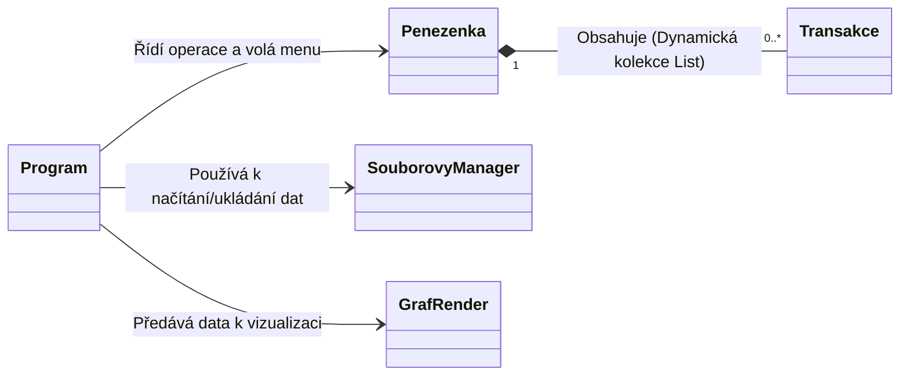

# Projekt: Správa osobních financí a rozpočtu

---

## 1. Zadání projektu
Cílem projektu je vytvořit aplikaci v jazyce C#, která uživateli umožní efektivně evidovat finanční příjmy a výdaje, kategorizovat je a sledovat celkový stav rozpočtu v reálném čase.

### Funkce programu:
* **Správa transakcí:** Možnost přidat a zobrazit příjmy a výdaje v přehledné historii.
* **Kategorizace:** Každá transakce je zařazena do konkrétní kategorie (např. Jídlo, Bydlení, Zábava, Výplata).
* **Analýza dat:** Zobrazení aktuálního celkového zůstatku peněženky v Kč.
* **Graf příjmů a výdajů:** Zobrazení ročního grafu čisté bilance za každý měsíc vykresleného pomocí textových znaků kostiček (`■`).

---

## 2. Jednoduchý model tříd včetně jejich vazeb
Aplikace využívá základní principy objektově orientovaného programování (OOP). Níže uvedený diagram popisuje vazby mezi jednotlivými komponentami:

---

## 3. Struktura aplikace (Třídy a metody)

### Třída `Program`
Slouží jako hlavní řídicí bod (vstupní bod) aplikace a zpracovává uživatelské menu.
* `Main(string[] args)`: Inicializuje peněženku, správce souborů a graf, načte historii transakcí z disku a spouští textovou smyčku s menu.
* `Overeni_intu()`: Zajišťuje bezpečnou konverzi vstupu na celé číslo (`int`) pomocí metody `int.TryParse` a předchází pádům programu při překlepu uživatele.

### Třída `Transakce`
Reprezentuje datový model pro jeden konkrétní finanční záznam.
* **Vlastnosti a pole:** `Castka` (`double`), `den`, `mesic`, `rok` (`int`), `Popis`, `Kategorie` (`string`), `JePrijem` (`bool`). Obsahuje také veřejné vlastnosti s velkým písmenem (`Den`, `Mesic`, `Rok`) pro kontrolu platnosti rozsahu zadávaných hodnot.
* `Transakce(...)`: Konstruktor pro nastavení všech hodnot nové transakce.
* `VypisDetail()`: Zobrazí podrobný řádek transakce. Příjmy tiskne zelenou barvou, výdaje červenou.

### Třída `Penezenka`
Obsahuje hlavní logiku ukládání historie a agregace dat.
* **Dynamické kolekce:** `Historie` (`List<Transakce>`).
* `PridatTransakci(Transakce novaTransakce)`: Vloží novou transakci do dynamického seznamu historie.
* `VypisHistorii()`: Projde celou kolekci transakcí a postupně volá jejich detaily.
* `SpoctiZustatek()`: Vrací aktuální celkový zůstatek (příjmy minus výdaje).
* `SpoctiMesicniPrijmy(int mesic, int rok)` / `SpoctiMesicniVydaje(int mesic, int rok)`: Počítá sumy pro konkrétní měsíce, které slouží jako podklad pro graf.

### Třída `SouborovyManager`
Zabezpečuje trvalé uchování dat na pevném disku.
* `UlozData(...)`: Stará se o textový zápis kompletní historie transakcí do souboru.
* `NactiData(...)`: Čte data ze souboru, rozděluje řádky podle oddělovače a skládá z nich objekty transakcí zpět do seznamu.

### Třída `GrafRender`
Zajišťuje vizuální textový výstup bilance do konzole.
* `VykreslyGraf(Penezenka penezenka, int rok)`: Přepočítá měsíční čisté zůstatky na poměrné měřítko (1 kostička = 1000 Kč) a vykreslí sloupcový graf (zelené kostičky nad osou pro kladnou bilanci, červené pod osou pro zápornou).

---

## 4. Popis práce se soubory
Aplikace ukládá data do jednoho textového souboru pomocí vestavěných systémových streamů `StreamWriter` a `StreamReader`. Data jsou ukládána jako textové řádky ve formátu hodnot oddělených středníkem (styl struktury CSV).

* **Soubor `finance.txt`:** Každý řádek obsahuje data jedné transakce oddělená středníkem.
  * *Příklad formátu:* `1500;12;6;2026;Nákup potravin;Jídlo;False`

**Ošetření chyb:** Program před každým pokusem o čtení kontroluje existenci souboru na disku pomocí metody `File.Exists()`. Pokud soubor neexistuje (např. při úplně prvním spuštění aplikace), program nespadne, ale bezpečně inicializuje prázdný seznam transakcí.

---

## 5. Popis ovládání
Program běží v textovém režimu konzole a ovládá se zadáním číselné volby **1 až 5** potvrzené klávesou **Enter**:

1. **Přidat transakci:** Uživatel postupně zadá částku, den, měsíc, rok, textový popis, název kategorie a určí typ transakce (1 = ano / 0 = ne) pro potvrzení příjmu.
2. **Vypsat historii:** Vypíše přehledný, barevně rozlišený seznam všech dosud zadaných a načtených transakcí.
3. **Zobrazit celkový zůstatek:** Vypíše do konzole větu „Aktuální zůstatek je:[částka] kč“.
4. **Zobrazit roční graf:** Uživatel zadá konkrétní rok a aplikace vygeneruje vertikální sloupcový graf z kostiček `■`, který přehledně ukazuje finanční úspěšnost nebo ztrátu měsíc po měsíci.
5. **Uložit a odejít:** Zapíše všechna aktuální data z paměti do souboru `finance.txt` a ukončí program.
